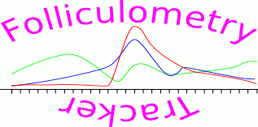
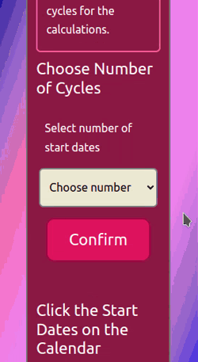

# Folliculometry Tracker



> A webapp for determining menstrual cycle parameters for better follicular tracking.

With **Folliculometry Tracker** you have a tool where you input the past and current menstrual flow dates and you get a summary about the cycle lengths and the range of days when ovulation is most likely to occur.

It is intended as a webapp that most especially helps women (but not excluding physicians, nurses, pharmacists, sonographers) to minimise the uncertainty about the right dates during investigations for infertility.

You can now know your body's endometrial/menstrual cycle better in an easy to use manner.

## Features and Usage

Clone this repo and open the index.html file in the browser or with a live server.

* Data input
  * Specify the number of cycles to be entered from the dropdown menu.
  * Enter the start date of each menstrual flow by clicking on calendar input or typing it.



* Result
  * Length of the shortest, longest and average cycles in days.
  * Shortest predicted date for ovulation in the current cycle.
  * Longest predicted date for ovulation in the current cycle.
  * Average predicted date for ovulation in the current cycle.

## Deployed

A live version is also available [here](https://tunprimus.gitlab.io/Folliculometry_Tracker/).

## Technology & Tools

* HTML5, CSS3 and vanilla JavaScript.
* VSCodium.
* LT browser and ResponsivelyApp.
* Lunacy, ksnip and Gifcurry.

## Sitemap

```markdown
.
├── COPYING.txt
├── css
│   └── style.css
├── images
│   ├── Folliculometry_Tracker_Logo.png
│   ├── Folliculometry_Tracker_Logo.svg
│   ├── FT_demo-01.gif
│   ├── FT_demo-02.gif
│   ├── FT_favicon.ico
│   └── menstrual_cycle_en.svg
├── index.html
├── js
│   ├── arithmeticGeometricMean.js
│   ├── date-day-library.js
│   ├── geometric_mean.js
│   └── main.js
├── README.md
├── results.html
└── tests
    └── tests-micro-framework
        ├── main.tests-micro-framework.html
        ├── main.tests-micro-framework.js
        └── tests-micro-framework-starter.css

```

## Future Implementations

1. Global reset and refresh.

2. User registration and sign in.

3. Adding charts.

4. Local storage of results.

5. Allow for multiple roles / portfolios per user; so that a user can input details of different clients.

6. Backend database with SQLite or PostgreSQL.

## Acknowledgements

The links below were especially useful in solving some of the challenges encountered during development.

- [Regex to validate date format](https://stackoverflow.com/questions/7388001/javascript-regex-to-validate-date-format)

- [Javascript nested ternary operator](https://stackoverflow.com/questions/44716426/javascript-nested-ternary-operator)

- [How to use JavaScript Ternary Operator?](https://refine.dev/blog/javascript-ternary-operator/)

- [Geometric mean (Two Methods)](https://www.geeksforgeeks.org/geometric-mean-two-methods/)

- [Testing JavaScript without a (third-party) framework](https://alexwlchan.net/2023/testing-javascript-without-a-framework/)

- [Unit Test Your JavaScript Code Without a Framework](https://javascript.plainenglish.io/unit-test-front-end-javascript-code-without-a-framework-8f00c63eb7d4)

## Licence
This project is licensed under the GNU General Public License v3.0 or later. [Learn more](https://www.gnu.org/licenses/gpl-3.0-standalone.html)
